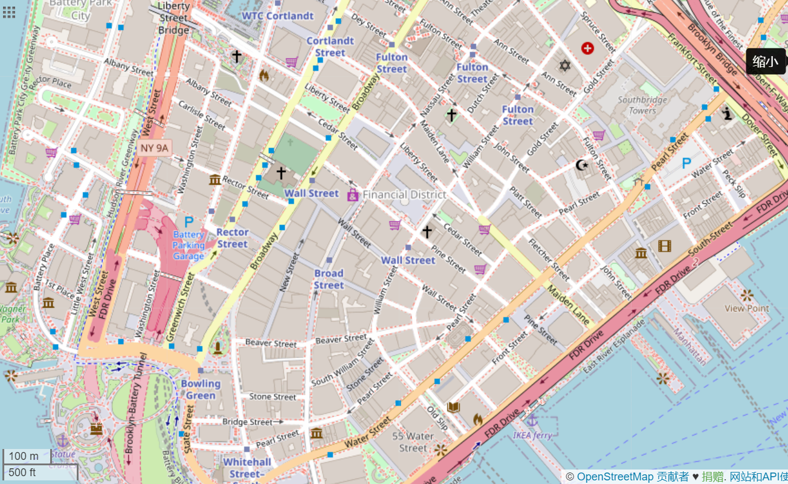
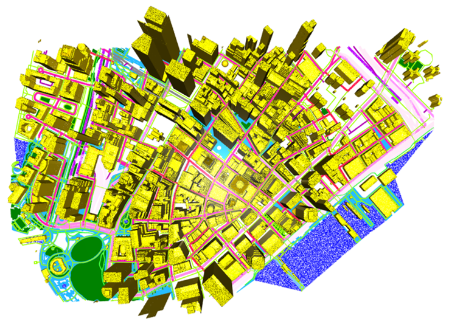
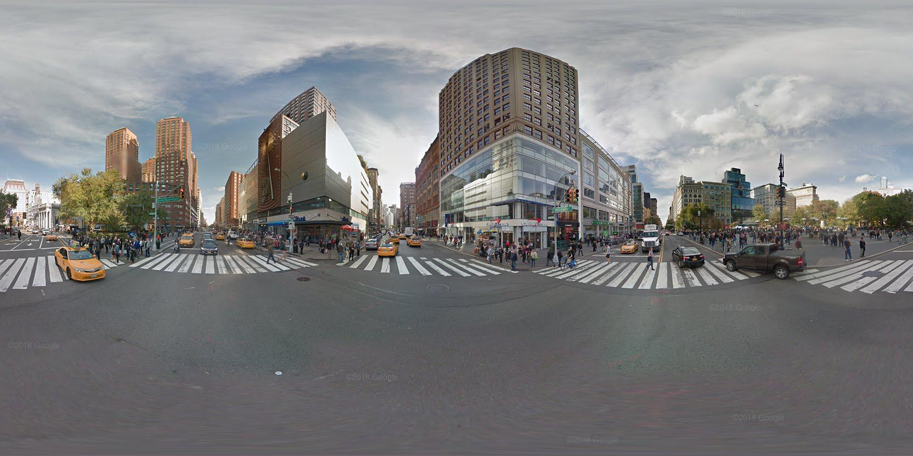
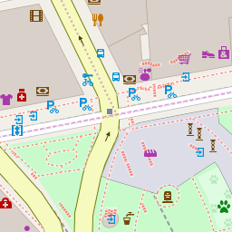
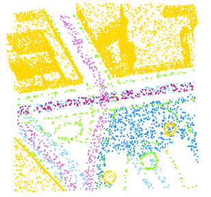

# A Large Scale Ground-to-2.5D Map Geolocalization Dataset
This repository contains datasets and codes related to our latest work:
- Image-based Geolocalization by Ground-to-2.5D Map Matching (to be published)

The main task of our work involves querying a ground-view image in relation to a large-scale and highly detailed georeferenced map, which consists of 2.5D structural map models and 2D aerial-view map images. Examples of the 2D and 2.5D maps are shown below.

2D map            |  2.5D map
:----------------:|:-------------------------:
  |  


## Datasets
Here, we present two ready-made datasets, each of which includes:
- Ground-view panoramic images (To request, please visit the project of [StreetLearn Dataset](https://sites.google.com/view/streetlearn/dataset "StreetLearn Dataset")). 
- 2D maps (To request, please visit our previous project: [You Are Here: Geolocation by Embedding Maps and Images](https://github.com/ZhouMengjie/Image-Map-Embeddings "You Are Here: Geolocation by Embedding Maps and Images")).


## Codes
We offer a Python implementation for generating a 2.5D map dataset, along with its prerequisite and data processing pipeline.

### Prerequisite
Here are the commands to configure your own environment using conda and pip:
```
conda create -n env_name python=3.8
pip3 install pyyaml
pip3 install pandas
pip3 install tqdm
pip3 install open3d==0.15.1 
```

### Data Processing Pipeline
#### Step 1. Obtain the metadata from the [OpenStreetMap](https://www.openstreetmap.org "OpenStreetMap").

```
python osm_loarder.py --dataroot 'datasets' --city 'manhattan'
```
- We've set the bounding box for Manhattan and Pittsburgh, allowing you to automatically obtain their .osm files.
- If your network connection is unstable, you can manually download the required files from the official OSM website.
- The resulting data will be stored in the following directory structure: \datasets\manhattan\manhattan.osm

#### Step 2. Obtain 2.5D models for each semantic category, represented in mesh structure.
```
blender --background --python blender_osm.py --dataroot 'datasets' --city 'manhattan'
```
- Install the [Blender 3.1.0](https://www.blender.org "Blender 3.1.0") and [Blender-osm addon](https://github.com/vvoovv/blender-osm/wiki/Documentation "blender-osm addon").
- The resulting data will be stored in the following directory structure: 
```
|–– datasets
|   |––manhattan
|   |   |––manhattan.txt
|   |   |––manhattan_obj
|   |   |   |––manhattan.osm_areas_footway.obj
|   |   |   |––manhattan.osm_buildings.obj
|   |   |   |––manhattan.osm_roads_primary.obj
```
- The (lat,lon) values saved in the .txt file are aligned with the origin of the Blender global coordinate system.
- There are 25 .obj files, each named after a specific semantic category.
- The .obj file mainly includes the following elements: o-object name, v-geometric vertices, vn-vertex normals, vt-texture vertices, mtllib-material library, usemtl-material name, f-face, and l-line.

#### Step 3. Generate a point cloud for each semantic category by using uniform sampling on the mesh.
```
python pcd_generate.py --dataroot 'datasets' --city 'manhattan' --radius 76 --density 0.1
```
- The resulting data will be stored in the following directory structure: 
```
|–– datasets
|   |––manhattan
|   |   |––manhattan_cropped
|   |   |––manhattanU_pcd
|   |   |   |––manhattan.osm_areas_footway.pcd
|   |   |   |––manhattan.osm_buildings.pcd
|   |   |   |––manhattan.osm_roads_primary.pcd
|   |   |––manhattanU.csv
```
- Since regions like bodies of water are interconnected, the actual downloaded 2.5D model will be much larger than the required area. To address this issue, we first cut the original data based on the bounding box and saved the cropped data in \manhattan_cropped.
- We use [barycentric coordinate](https://chrischoy.github.io/research/barycentric-coordinate-for-mesh-sampling/ "barycentric coordinate") to achieve uniform sampling of the mesh.
- The semantic label of each point is saved in a .csv file.
- Refer to "color_map.yaml" for each category's name, label, and encoded color.

#### Step 4. Merge the point clouds of each semantic category into a single point cloud representing the entire area.
```
python pcd_merge.py --dataroot 'datasets' --city 'manhattan'
```
- The resulting data will be stored following this directory structure: \datasets\manhattan\manhattanU.pcd or manhattanU.npy.
- The .pcd file contains the coordinates and colors of each point, while the .npy file only contains the coordinate information.

#### Step 5. Generate map subsets for training, validation, and testing using multiprocessing.
```
python utils/lat2xy.py --dataroot 'datasets' --area 'unionsquare5kU'
python utils/merge_csv.py
python map_dataset_mp.py --dataroot 'datasets' --area 'unionsquare5kU' --radius 114 --num_threads 16
```
- First, for each of the five areas named 'hudsonriver5kU', 'wallstreet5kU', 'unionsquare5kU', 'trainstreetlearnU', and 'cmu5kU', you need to convert the center (lat, lon) of each local region provided in the .csv files to (x, y) coordinates. The .csv files for 'trainstreetlearnU' and 'cmu5kU' are combined for the purpose of training.
- Then, the local region is cropped from the whole area point cloud using the radius centered at (x, y). The radius is defined as original_radius * sqrt(2), which can ensure that there is no loss of information after rotating the magnified area and restoring it to its original size.

#### The final data will be stored in the following directory structure:
```
|–– datasets
|   |––csv
|   |––manhattan
|   |––pittsburgh
|   |––jpegs_manhattan_2019
|   |––jpegs_pittsburgh_2019
|   |––tiles_manhattan_2019
|   |––tiles_pittsburgh_2019
|   |––trainstreetlearnU_cmu5kU_idx
|   |––hudsonriver5kU_idx
|   |––wallstreet5kU_idx
|   |––unionsquare5kU_idx
```
- Ground-view images and 2.5D maps are saved with unique identifiers, while 2D maps are saved with a global index.
- The folders "manhattan" and "pittsburgh" can be obtained with the provided [extraction code](https://pan.baidu.com/s/1XTy4qbMVDXHIjPJi2JZVqw "extraction code") "data".
- We offer a set of data in the \datasets\examples directory and a "visualizer.py" script to assist users in conducting visualization checks.

Ground-view Image                       |  2D map                | 2.5D map         
:-------------------------:|:-------------------------:|:-------------------------:
  |   | 


## FAQ
1. To install Open3D on Linux, you may encounter compatibility issues with the GLIBC version.
- We have found that installing Open3D on MacOS or Windows systems is a much simpler process compared to installing it on Linux, which may require additional steps such as updating GLIBC versions.
- If you have root authority, you can upgrade the GLIBC version on Linux to a compatible version for open3d-0.15.0. 
3. In Step 3, you may encounter a message stating "[Open3D INFO] Skipping non-triangle primitive geometry of type: 6".
- This message indicates that Open3D is skipping non-triangle primitive geometry of type 6, which is line geometry. This may happen if your .obj file contains lines (l) instead of faces (f). To fix this, you should check your .obj files and delete the "l" (line) entries manually. Alternatively, you can convert the line geometry into face geometry by adding new faces to the .obj file that approximate the lines.
4. If you have any other questions, please feel free to leave a message or contact me via "mengjie.zhou@bristol.ac.uk".


## To release
- codes for learning embedding space
- codes for route based geolocalization
